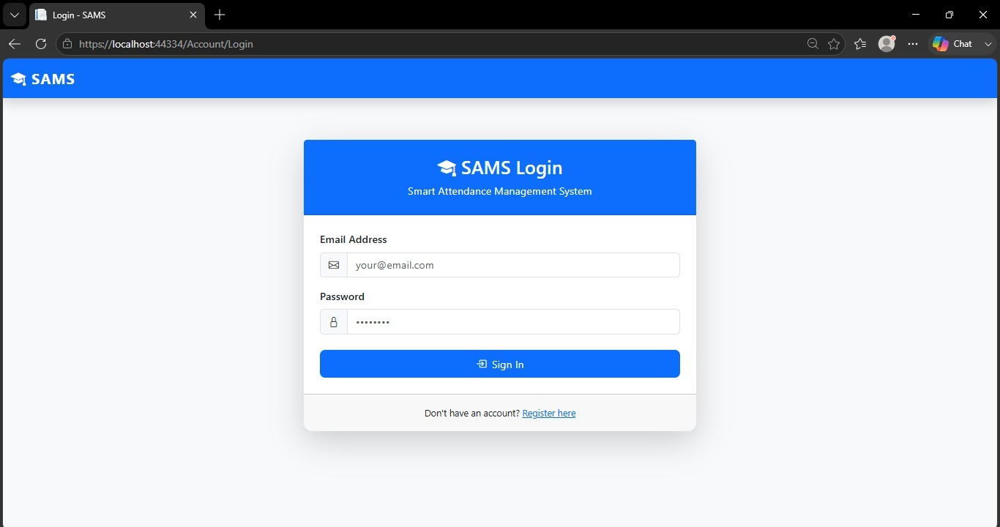
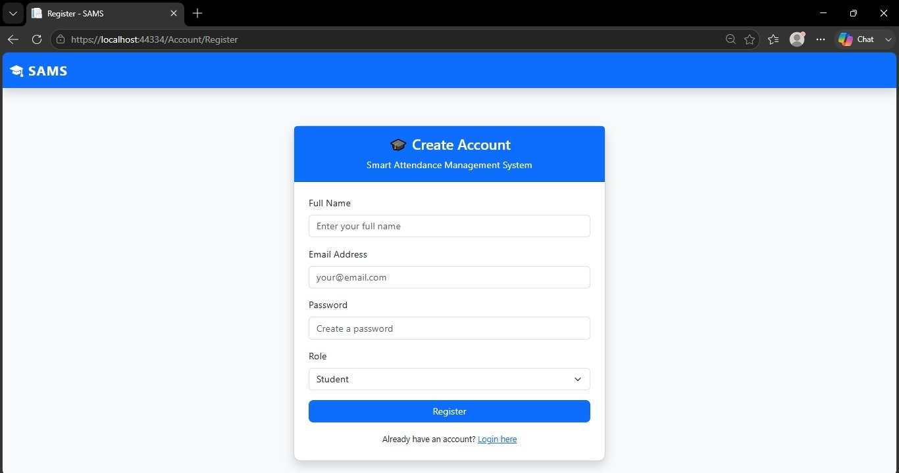
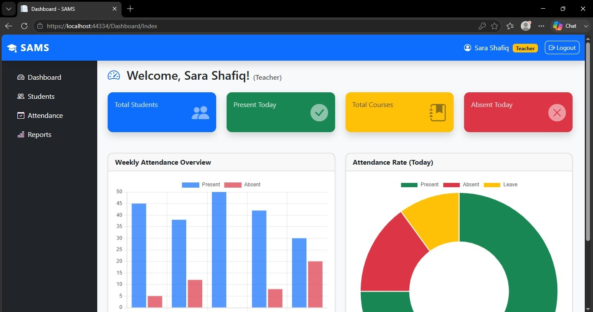
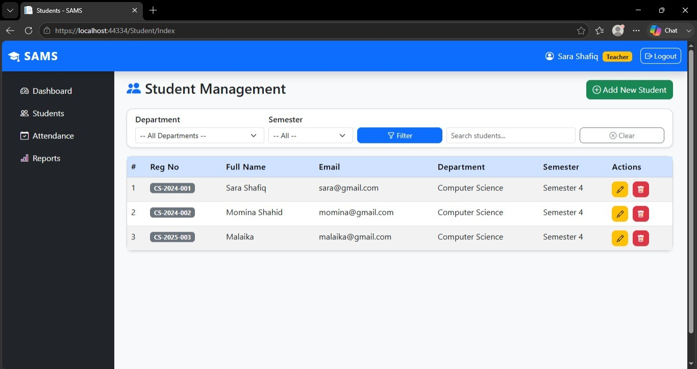
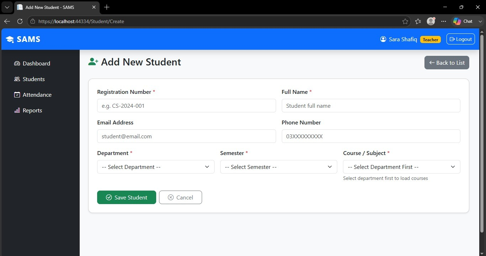
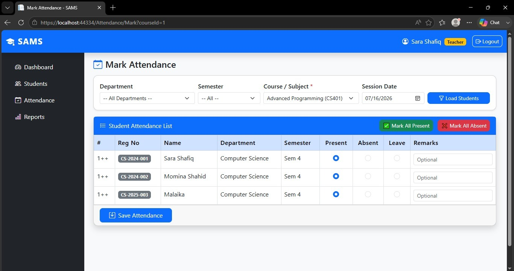
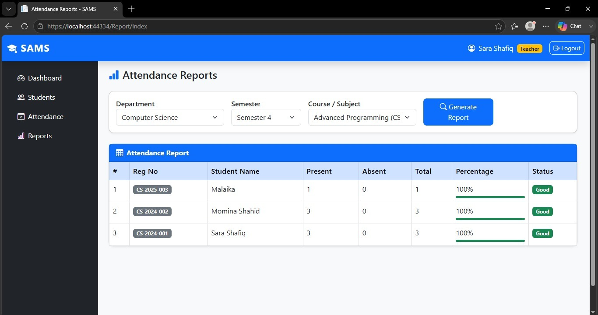
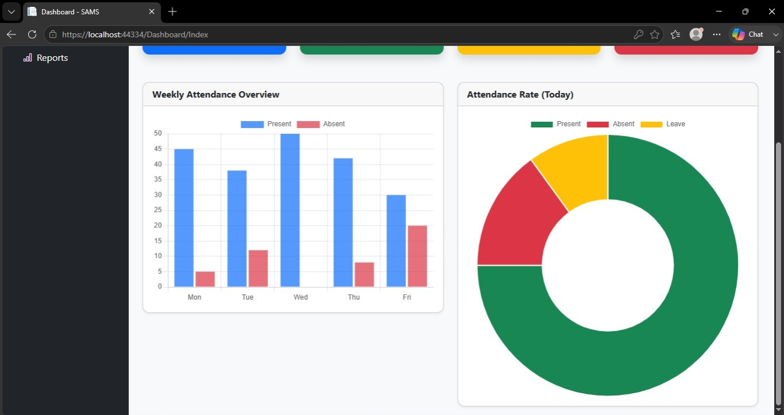

# 🎓 Smart Attendance Management System
A full-stack attendance management system developed to streamline student attendance tracking, reporting, and administration using ASP.NET, C#, and SQL Server.

---

## ✨ What Makes It Different

- 📊 **Live Attendance Dashboard** — real-time stats showing present, absent, late & below-75% students
- 🚨 **75% Alert System** — automatically flags students who fall below the required attendance threshold
- 🖨️ **RDLC Report Generator** — printable monthly attendance reports by class and subject
- 👥 **Role-Based Access Control** — separate dashboards for Admin, Teacher and Student
- 📅 **Bulk Attendance Marking** — mark entire class Present/Absent/Late/Leave in one click
- 🔐 **Session Management** — secure login with session-based authentication across all pages

---

## 🛠️ Built With

`ASP.NET Web Forms` `ASP.NET MVC` `Windows Forms` `SQL Server` `ADO.NET` `Entity Framework` `C#` `Bootstrap 5` `RDLC Reports`

---

## 📋 Features

✅ Student Management

✅ Class & Subject Management

✅ Attendance Management

✅ Attendance Reports

✅ User Authentication

✅ Role-Based Access Control

✅ CRUD Operations

✅ 3-Tier Architecture

✅ Stored Procedures

✅ Responsive Interface

---

## 📸 Project Screenshots

| Login | Registration |
|-------|--------------|
|  |  |

| Dashboard | Student Management |
|-----------|--------------------|
|  |  |

| Add Student | Mark Attendance |
|-------------|-----------------|
|  |  |

| Reports | Dashboard |
|----------|-----------|
|  |  |

---

## 🚀 Installation

```bash
git clone https://github.com/sarashafique225/Smart-Attendance-Management-System.git
```
> Open `SmartAttendanceSystem.sln` in Visual Studio
> Run `Database/SmartAttendanceDB.sql` in SSMS
> Run `Database/StoredProcedures.sql` in SSMS
> Update connection string in `SmartAttendance.DAL/DbConn.cs`
> Press `Ctrl+Shift+B` to build, then `F5` to run

---

## 👥 Developed By

**Sara Shafiq**
